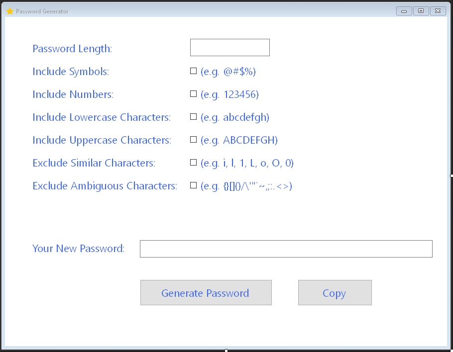

# PasswordGenerator
Password generator using Windows Forms

Basic password generator
- Default password is 8 character - digits and lowercase letters only.
- Options to add symbols and uppercase letters and also remove certain characters.

